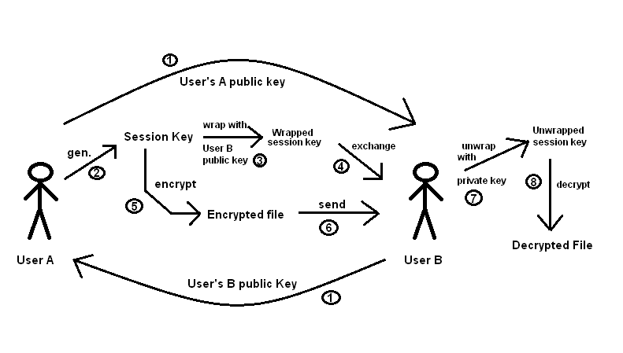
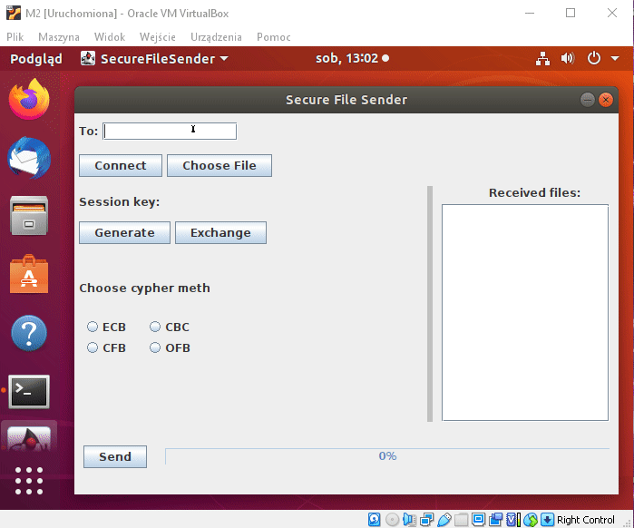
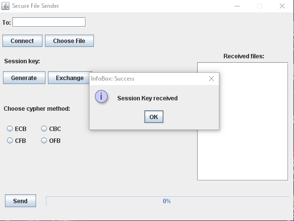

# Secure File Sender
Java Desktop Application for secure file transfer.

## Table of contents
* [General info](#general-info)
* [Working Principle](#working-principle)
* [Cipher Principle](#cipher-principle)
* [Setup](#setup)
* [View](#view)
* [Speed Test](#speed-test)

## General info
This Java application allows two users to remotely establish an internet connection to securely exchange encrypted files.
	
## Working Principle
The application has a simple graphical user interface that allows us to enter the IP address of the user to whom we want to send the file. </br>
To send the file safely, you need to generate a session key (secret key) that will first be encrypted using asymmetric encryption, </br>
and then sent to the user at the click of a button "exchange". Next, choose one of the 4 encryption methods (ECB, CBC, CFB, OFB), this application uses AES block cipher.
After clicking on the Send button, the user sends the encrypted file by TCP/IP protocol. </br>
You can observe the process of performing encryption and sending the file on the progress bar. </br>

## Cipher principle
To make file sharing more secure and faster, asymmetric and symmetric encryption is used. </br>
 </br>
1. Public keys exchange between User A and User B (keys are exchanged automatically when a connection is established).
2. User who wants to send file click "Generate" button for generating the session key.
3. Session key is wrapped with User B public key. (Asymmetric encryption)
4. User clicks the "exchange" button and the wrapped session key goes to User B.
5. User A uses a session key (not wrapped) for file encryption (Symmetric encryption).
6. After clicking the "Send" button encrypted file goes to User B.
7. User B uses his private key for unwrapping the session key (Asymmetric encryption).
8. User B uses an unwrapped session key for decrypting encrypted files (Symmetric encryption).
	
## Setup
To run this application, download the SecureFileSender-1.0-SNAPSHOT.jar file for both computers.
You can use Virtual Box to simulate client B, be sure that network configuration is properly set to "VirtualBox Host-Only Ethernet Adapter". </br>
and that firewall is disabled. In Linux terminal:
```
sudo ufw disable
```
To execute an application in the command prompt write of both computers (virtual machines):
```
java -jar SecureFileSender-1.0-SNAPSHOT.jar
```

## View
Sender side:  </br>
 </br>

Receiver side:  </br>
 </br>

## Speed Test
Callculated time for encryption/decryption of eigth different sized files. </br>

<table>
<thead>
  <tr>
    <th colspan="3">File Size:</th>
    <th>0.01 MB</th>
    <th>3.5 MB</th>
    <th>51 MB</th>
    <th>101 MB</th>
    <th>222 MB</th>
    <th>446 MB</th>
    <th>728 MB</th>
    <th>1546 MB</th>
  </tr>
</thead>
<tbody>
  <tr>
    <td rowspan="8">Cipher Mod</td>
    <td rowspan="2">ECB<br></td>
    <td>enc. time</td>
    <td>0.015s</td>
    <td>0.105s</td>
    <td>0.458s</td>
    <td>0.65s</td>
    <td>1.329s</td>
    <td>3.076</td>
    <td>7.833s</td>
    <td>16.191s</td>
  </tr>
  <tr>
    <td>dec. time</td>
    <td> &lt; 0.0s</td>
    <td>&lt; 0.0s</td>
    <td>&lt; 0.0s</td>
    <td>0.001s</td>
    <td>0.002s</td>
    <td>0.008s</td>
    <td>0.008s</td>
    <td>0.069s</td>
  </tr>
  <tr>
    <td rowspan="2">CBC<br></td>
    <td>enc. time</td>
    <td>0.017s</td>
    <td>0.08s</td>
    <td>0.619s</td>
    <td>1.195s</td>
    <td>2.779s</td>
    <td>5.897s</td>
    <td>8.817s</td>
    <td>17.361s</td>
  </tr>
  <tr>
    <td>dec. time</td>
    <td>&lt; 0.0s</td>
    <td>&lt; 0.0s</td>
    <td>&lt; 0.0s</td>
    <td>0.001s</td>
    <td>0.002s</td>
    <td>0.002s</td>
    <td>0.004s</td>
    <td>0.021s</td>
  </tr>
  <tr>
    <td rowspan="2">CFB<br></td>
    <td>enc. time</td>
    <td>0.005s</td>
    <td>0.076s</td>
    <td>0.68s</td>
    <td>1.235s</td>
    <td>3.353s</td>
    <td>6.851</td>
    <td>10.272s</td>
    <td>21.351s</td>
  </tr>
  <tr>
    <td>dec. time</td>
    <td>&lt; 0.0s</td>
    <td>&lt; 0.0s</td>
    <td>&lt;0.0s</td>
    <td>0.001s</td>
    <td>0.003s</td>
    <td>0.005s</td>
    <td>0.009s</td>
    <td>0.027s</td>
  </tr>
  <tr>
    <td rowspan="2">OFB<br></td>
    <td>enc. time</td>
    <td>0.004s</td>
    <td>0.083s</td>
    <td>0.641s</td>
    <td>1.386s</td>
    <td>4.109s</td>
    <td>7.268s</td>
    <td>10.434s</td>
    <td>21.157s</td>
  </tr>
  <tr>
    <td>dec. time</td>
    <td>&lt; 0.0s</td>
    <td>&lt; 0.0s</td>
    <td>&lt; 0.0s</td>
    <td>0.002s</td>
    <td>0.003s</td>
    <td>0.006s</td>
    <td>0.012s</td>
    <td>0.035s</td>
  </tr>
</tbody>
</table>
